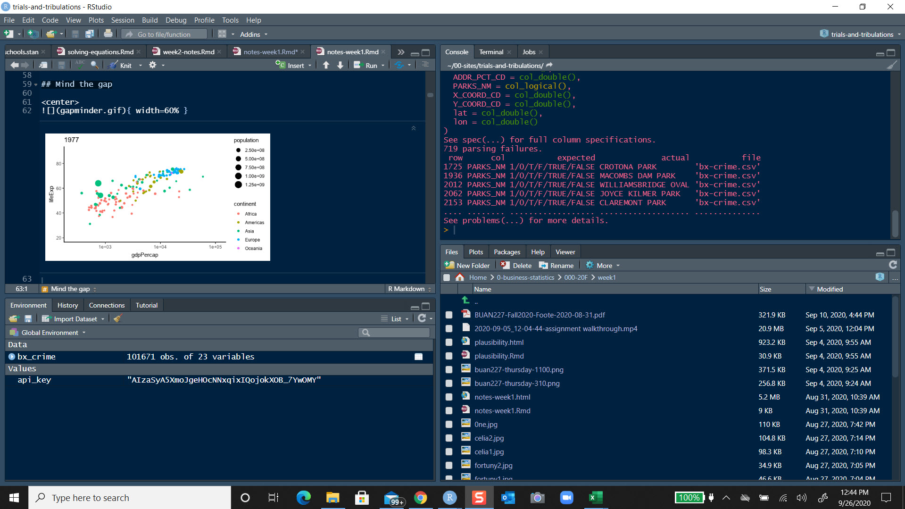

```{r , include=FALSE}
knitr::opts_chunk$set(echo = TRUE, warning=FALSE, message=FALSE)
knitr::opts_chunk$set(tidy = TRUE)
knitr::opts_chunk$set(tidy.opts=list(width.cutoff=36))
options(tinytex.verbose = TRUE)
```

# Warming up to R and more


## Overview

In this chapter we will

- Discuss R for analytics

- Install R, RStudio, and Latex

- Install R markdown and run a document

- Have some fun with STAN

## What is `R`?

`R` is software for interacting with data along a variety of user generated paths. With `R` you can create sophisticated (even interactive) graphs, you can carry out statistical and operational research analyses, and you can create and run simulations. `R` is also a programming language with an extensive set of built-in functions. With increasing experience, you can extend the language and write your own code to build your own financial analytical tools. Advanced users can even incorporate functions written in other languages, such as C, C++, and Fortran.

The current version of `R` derives from the `S` language. `S` has been around for more than twenty years and has been with extrensive use in statistics and finance, first as `S` and then as the commercially available `S-PLUS`. `R` is an open source implementation of the `S` language that is now a viable alternative to `S-PLUS`. A core team of statisticians and many other contributors work to update and improve `R` and to make versions that run well under all of the most popular operating systems. Importantly, `R` is a free, high-quality statistical software that will be useful as you learn financial analytics even though it is also a first-rate tool for professional statisticians, operational researchers, and financial analysts and engineers.\footnote(But see this post on a truly big data language APL: <https://scottlocklin.wordpress.com/2013/07/28/ruins-of-forgotten-empires-apl-languages/>)

## `R` for analytics

There are several reasons that make `R` an excellent choice of software for an analytics course. Some benefits of using `R` include:

* `R` is free and available online. `R` is open-source and runs on `UNIX`, `Windows`, and `Macintosh` operating systems.

* `R` has a well-documented, context-based, help system enhanced by a wide, and deep, ranging user community globally and across several disciplines.

* `R` has excellent native static graphing capabilities. Interactive dynamic graphics are evolving along with the ability to embed analytics into online applications. With `R` you can build dashboards and websites to communicate results dynamically with consumers of the analytics you generate.

* Practitioners can easily migrate to the commercially supported `S-Plus` program, if commercial software is required. `S` and `S-Plus` are the immediate ancestors of the R programming environment. Cloud computing is now available with large data implementations. Microsoft now supports a commercial `R` version.

* `R`'s language has a powerful, easy-to-learn syntax with many built-in statistical and operational research functions. Just as important are the extensive web-scraping, text structuring, object class construction, and the extensible functional programming aspects of the language. A formal language definition is being developed. This will yield more standardization and better control of the language in future versions.

* `R` is a computer programming language. For programmers it will feel more familiar than for others, for example Excel users. `R` requires array thinking and object relationships that are not necessarily native, but indeed are possible, in an Excel spreadsheet environment. In many ways, the Excel style and `R` style of environments complement one another. 

* Even though it is not necessarily the simplest software to use, the basics are easy enough to master, so that learning to use `R` need not interfere with learning the statistical, operational research, data, and domain-specific concepts encountered in an analytics-focused course.[^simple]

[^simple]: The attribute _simple_ is relative. For example, this Excel formula with nested if statements is far from _simple_ to understand, document, and implement: `=if(x3 = 1, 2, if(y2=0, "42"&cell(3, 2), if(left(a$4$, find(b$4$, "=42"))))).

- Doing statistics in a spreadsheet (e.g., Microsoft Excel) is generally a bad idea. While hundreds of millions of Excel users might disagree with this proposition learn the lesson of the 415 Report spreadsheet model to manage risks at JP Morgan Chase. Although many people are likely feel more familiar with them, spreadsheets are very limited in terms of what analyses they allow you do. If you get into the habit of trying to do your real life data analysis using spreadsheets, then you've dug yourself into a very deep hole.

- Proprietary software is expensive, not very extensible, and has many routines that are often opaque to users. When you have a chance look up the cost of a Matlab or SAS single user license. The tools you will need will be provided a la carte at a price for licensing fees.

- `R` is highly extensible. When you download and install R, you get all the basic "packages", and those are very powerful on their own. However, because R is so open and so widely used, it's become something of a standard tool in statistics, and so lots of people write their own packages that extend the system -- all freely available.

- R is a real programming language. As you get better at using R for data analysis, you're also learning to program. When you program you must think through  the question you are posing, the data you are collecting, the analytical techniques you will deploy, the visualization of your results. This workflow is commonly called the _**software development lifecycle**_. If you don't already know how to program, then learning how to do statistics using `R` is a good way to begin.

There is at least one drawback.

* The primary hurdle to using `R` is that most existing documentation and plethora of packages are written for an audience that is knowledgable about statistics and operational research and has experience with other statistical computing programs. In contrast, this course intends to make `R` accessible to you, especially those who are new to both statistical concepts and statistical computing.

## Hot and cold running resources

Much is available in books, e-books, and online for free. This is an extensive online community that links expert and novice modelers globally.

The standard start-up is at CRAN  <http://cran.r-project.org/manuals.html>. A script in the appendix can be dropped into a workspace and played with easily. You can easily skip the rest of this expose on isntalling R, the integrated development environment RStudio, and some generous quips about computing, by simply goingn to the excellent on-line (and free) resource by James D. Long and Paul Teetor. 2019. _R Cookbook 2nd Edition_. O'Reilley: Sebastopol, CA. A version of this resource is [\underline{accessible here}](https://rc2e.com/) with extensive R and RStudio installation instructions.

Other resources include:

- Julian Faraway's <https://cran.r-project.org/doc/contrib/Faraway-PRA.pdf> complete course on regression where you can imbibe deeply of the many ways to use `R` in statistics. 
- Along econometrics lines is Grant Farnsworth's <https://cran.r-project.org/doc/contrib/Farnsworth-EconometricsInR.pdf>. 
- Winston Chang's <http://www.cookbook-r.com/> and Hadley Wickham's example at <http://ggplot2.org/> are terrific online graphics resources.
- Psychologist Danielle Navarro's Libretext <https://learningstatisticswithr.com> is a great companion to any statistical reasoning we might perform.

## Installing  R{#gettingR}

R  needs to be installed on your computer. Anyway, R  is freely distributed online, and you can download it from the  R  homepage, which is:

>http://cran.r-project.org/

At the top of the page -- under the heading "Download and Install R" -- you'll see separate links for Windows users, Mac users, and Linux users. If you follow the relevant link, you'll see that the online instructions are pretty self-explanatory. 

As of this writing, the current version of  R  is 4.0.2 "Taking Off Again" -- and each new version will have even more creative names. Here is what you would see at the console.

```
R version 4.0.2 (2020-06-22) -- "Taking Off Again"
Copyright (C) 2020 The R Foundation for Statistical Computing
Platform: x86_64-w64-mingw32/x64 (64-bit)

R is free software and comes with ABSOLUTELY NO WARRANTY.
You are welcome to redistribute it under certain conditions.
Type 'license()' or 'licence()' for distribution details.

  Natural language support but running in an English locale

R is a collaborative project with many contributors.
Type 'contributors()' for more information and
'citation()' on how to cite R or R packages in publications.

Type 'demo()' for some demos, 'help()' for on-line help, or
'help.start()' for an HTML browser interface to help.
Type 'q()' to quit R.
```
R updates every six months or so, but don't worry, the now current version will suffice.

### Installing R on a Windows computer

The CRAN homepage changes from time to time, and it's very old-school web design, but you can usually find what you are look for. In general you'll find a link at the top of the page with the text "Download R for Windows". If you click on that, it will take you to a page that offers you a few options. Again, at the very top of the page you'll be told to click on a link that says to click here if you're installing R for the first time. That's probably what you want. This will take you to a page that has a prominent link at the top called "Download R 4.0.2 for Windows". That's the one you want. Click on that and your browser should start downloading a file called `R-4.0.2-win.exe`, or whatever the equivalent version number is by the time you read this. 

The file for version 4.0.2 is about 84MB in size, so it may take some time depending on how fast your connection is. Once you've downloaded the file, double click to install it. As with any software you download online, Windows will ask you some questions about whether you trust the file and if it can alter your system. Say yes. 

After you click through those, it'll ask you where you want to install it, and what components you want to install. Your PC should be a 64 bit machine to run the routines for the rest of this book. The default values should be fine for most people, so again, just click through.  Once all that is done, you should have  R  installed on your system. You can access it from the Start menu, or from the desktop if you asked it to add a shortcut there. 

While it may be some fun to open up R through the desktop shortcut, I suggest is that instead of doing that you should now install RStudio (see Section \@ref(installingrstudio) for instructions).

One other thing (always one more thing!): to run the tools in this book, you must install `RTools40` for Windows based systems. This will allow you to use the `Rcpp` C++ compiler that is under the hood of the `rstan`, `rethinking`, `brms`, and `tidybayes` packages. For more details visit <https://rstan.org>.

### Installing R on a Mac

When you click on the Mac OS X link, you should find yourself on a page with the title "R for Mac OS X". The vast majority of Mac users will have a fairly recent version of the operating system: as long as you run macOS 10.13 (High Sierra), then you'll be fine.[^old]

[^old]; If you're running an older version of the Mac OS, then you need to follow the link to the "old" page (http://cran.r-project.org/bin/macosx/old/). You should be able to find the installer file that you need at the bottom of the page.] There's a fairly prominent link on the page called "R-4.0.2.pkg", which is the one you want. Click on that link and you'll start downloading the installer file, which is `R-4.0.2.pkg`. It's about 84MB in size.

Once you've downloaded `R-3.0.2.pkg`, all you need to do is open it by double clicking on the package file. The installation should go smoothly from there: just follow all the instructions just like you usually do when you install something. Once it's finished, you'll find a file called `R.app` in the Applications folder. You can now open up R in the usual way^[Tip for advanced Mac users. You can run  R  from the terminal if you want to. The command is just "R". It behaves like the normal desktop version, except that help documentation behaves like a "man" page instead of opening in a new window.] if you want to, but what I'm going to suggest is that instead of doing that you should now install RStudio (see Section \@ref(installingrstudio) for instructions). 

### Installing R on a Linux computer

If you run a Linux box, regardless of what distribution, then you should find the instructions on the website easy enough. You can compile R from source yourself if you want, or install it through your package management system, which will probably have R in it.

Alternatively, the CRAN site has precompiled binaries for Debian, Red Hat, Suse and Ubuntu and has separate instructions for each. Once you've got R installed, you can run it from the command line just by typing `R`. However, if you're feeling envious of Windows and Mac users for their fancy GUIs, you can download RStudio too (see Section \@ref(installingrstudio) for instructions).

### Downloading and installing  RStudio{#installingrstudio}

When you install R initially, it comes with one application that lets you do run R natively in an R GUI: it's the R.exe application on a Windows machine, and the R.app application on a Mac. There are many integrated development environments (IDE) that will look for R and display the R console, while also allowing you to manage files, projects, look at your coding history, and review a variety of other objects. `Jupyter` is one such system that runs Julia, Python, and R interoperatively. The one I use exclusively, mainly for its one-stop-shop philosophy of data management, analysis cycles, and production of results in reports, books (like this one), and presentations, is `RStudio`. You can download the free personal version of `RStudio` here:

>http://www.RStudio.org/

When you visit the RStudio website, you'll see a new school user interface, much easier to navigate and simpler than the CRAN website,[^rstudio]

[^rstudio]: This is probably no coincidence: the people who design and distribute the core R language itself are focused on technical stuff. And sometimes they almost seem to forget that there's an actual human user at the end. The people who design and distribute RStudio are focused on the user. Their goal is to make R as available, usable, auditable as possible.

Just click the `Download` button and follow the directions to the desktop version for your system.  

After it's finished installing, you start R by opening RStudio.  You don't need to open R.app or R.exe in order to access R. RStudio will take care of that for you. In this screenshot you can see four panels. One of them is the R console.



The midnight blue background helps my eyesight. Your very first Rstudio job is to set up a new Project. This will create a `*.Rproj` file in a working directory. It is in that working directory that you will perform all of your computing. I use one for each week of instruction, for each paper or presentation I am writing, for this book too. Your programming life will thank you for this habit.

RStudio has extensive guidance on everything from [authoring slides](https://support.rstudio.com/hc/en-us/articles/200486468-Authoring-R-Presentations) to [numerous cheatsheets]() that will help us navigate packages.

The only shortcoming with RStudio is that it's a perpetual work in progress: they keep improving it! Having said that I have found that updating RStudio is easy, and does not interfere with my workflows, file directories, R installation, packages, and so forth.

## First day at school

Always with some fear and trepidation we enter a new phase of learning. Let's dive right into the deep end of this pool. 

### Install `R Markdown`

Click on `RStudio` in your tray or start up menu. Be sure you are connected to the Internet. A console panel will appear. At the console prompt `>` type

```{r, eval = FALSE}
install.packages("rmarkdown")
```

* This action will install the `rmarkdown` package. 

* This package will enable you to construct documentation for your work as well as actually run the code you build.

If you have several packages to attach to your workspace you can use this function to check if the packages are installed, attach installed packages, and install packages not yet installed. You can copy and paste the `is_installed()` function (yes, your first function) and the `pkg` vector into the console. Then we call the function with the `pkg` argument.

```{r, eval = FALSE}
is_installed <- function(x){
  for(i in x){
    # require will return TRUE (1) "invisibly" if it was able to load package
    if(!require(i, character.only = TRUE)){
      # If, for any reason, the package was not able to be loaded then re-install and expect a
      # RStudio message
      install.packages(i , dependencies = TRUE)
      #  Attach the package after installing
      require(i , character.only = TRUE)
    }
  }
}
# for example here is a  vector of concatenated character strings assigned to the obj `pkg`
pkg <- c("rmarkdown", "shiny", "psych", "knitr", "tidyverse", "ggthemes", "plotly", "moments", "flexdashboard", "GGally")
# use `pkg` as the "argument" of the function `is_installed()`
is_installed(pkg)
```

Voila and we have packages in our library. We will add more packages as we go along. But these will suffice for now.

* This extremely helpful web page, <http://rmarkdown.rstudio.com/gallery.html>,  is a portal to several examples of `R Markdown` source files that can be loaded into `RStudio`, modified, and used with other content for your own work. 

## Install LaTex

Even though matheatics is kept to a low roar in this book, we can profitably use a comprehensive text rendering system for our documents. `R Markdown` uses a text rendering system called `LaTeX` to render text, including mathematical and graphical content. We can install the`tinytex`,  or `MikTeX` document rendering system for `Windows` or `MacTeX` document rendering system for `Mac OS X`. This book is rendered with `tinytex`.

- For `tinytex`just follow Yihui's instructions:

```
Installing and maintaining TinyTeX is easy for R users, since the R package tinytex has provided wrapper functions (N.B. the lowercase and bold tinytex means the R package, and the camel-case TinyTeX means the LaTeX distribution). You can use tinytex to install TinyTeX:

install.packages('tinytex')
tinytex::install_tinytex()
# to uninstall TinyTeX, run tinytex::uninstall_tinytex() 
```
Yes, that simple.

- For `Windows`, navigate to the <https://miktex.org/download> page and go to the **64- or 32- bit** installer. Click on the appropriate `Download` button and follow the directions. **Be very sure you select the _COMPLETE_ installation**. Frequently Asked Questions (FAQ) can be found at <https://docs.miktex.org/faq/>. If you have `RStudio` already running, you will have to restart your session.

- For `MAC OS X`, navigate to the <http://www.tug.org/mactex/> page and download the `MacTeX` system and follow the directions. This distribution requires Mac OS 10.5 Leopard or higher and runs on Intel or PowerPC processors. **Be very sure you select the _FULL_ installation**. Frequently Asked Questions (FAQ) can be found at <https://docs.miktex.org/faq/>. If you have `RStudio` already running, you will have to restart your session. FAQ can be found at <http://www.tug.org/mactex/faq/index.html>.

### Our first file

Open `RStudio` and see something like this screenshot...


* You can modify the position and content of the four panes by selecting `View > Panes > Pane Options`.

* If you haven't already, definitely `install.packages("rmarkdown")`. Then in the console again enter `library(rmarkdown)`. Under `File > New File > Rmarkdown` a dialog box invites you to open document, presentation, Shiny, and other files. Upon choosing `documents` you may open up a new file. Under `File > Save As` save the untitle file in an appropriate directory. The `R Markdown` file extension `Rmd` will appear in the file name in your directory.

* When creating a new `Rmarkdown` file, `RStudio` deposits a template that shows you how to use the markdown approach. You can generate a document by clicking on `knit` in the icon ribbon attached to the file name tab in the script pane. If  you do not see  `knit`, then you might need to install and load the  `knitr` package with the following statements in the `R` console. You might need also to restart your RStudio session.

```{r, eval = FALSE}
install.packages("knitr")
library(knitr) # also can use `library()`
```

The `Rmd` file contains three types of content:

1.  An (optional) __YAML header__ surrounded by `---` on the top and the bottom of `YAML` statements. `YAML` is "Yet Another Markdown (or up) Language". Here is an example from this document:

```YAML
---
title: "Setting Up R for Analytics"
author: "Bill Foote"
date: "November 11, 2016"
output: pdf_document
---
```

2.  __Chunks__ of R code surrounded by \`\`\` (find this key usually as the lowercase of the `~` symbol).
3.  Text mixed with text formatting like `# heading` and `_italics_` and mathematical formulae like `$z = \frac{(\bar x-\mu_0)}{s/\sqrt{n}}$` which will render

$$z = \frac{(\bar x-\mu_0)}{s/\sqrt{n}}$$.

When you open an `.Rmd` file, `RStudio` provides an interface where code, code output, and text documentation are interleaved. You can run each code chunk by clicking the `Run` icon (it looks like a play button at the top of the chunk), or by pressing `Cmd/Ctrl + Shift + Enter`. `RStudio` executes the code and displays the results in the console with the code.

You can write mathematical formulae in an `R Markdown` document as well. For example, here is a formula for net present value.

```LATEX
$$
NPV = \sum_{t=0}^{T} \frac{NCF_t}{(1+WACC)^t}
$$
```
This script will render

$$
NPV = \sum_{t=0}^{T} \frac{NCF_t}{(1+WACC)^t}
$$

* Here are examples of common in file text formatting in `R Markdown`.

```
Text formatting 
------------------------------------------------------------

*italic*  or _italic_
**bold**   __bold__
_**bold and italic**_
`code`
superscript^2 and subscript_2

Headings
------------------------------------------------------------

# 1st Level Header

## 2nd Level Header

### 3rd Level Header

Lists
------------------------------------------------------------

*   Bulleted list item 1

*   Item 2

    * Item 2a

    * Item 2b

1.  Numbered list item 1

1.  Item 2. The numbers are incremented automatically in the output.

Links and images
------------------------------------------------------------

<http://example.com>

[linked phrase](http://example.com)


Tables 
------------------------------------------------------------

First Header  | Second Header
------------- | -------------
Content Cell  | Content Cell
Content Cell  | Content Cell

Math
------------------------------------------------------------

$\frac{\mu}{\sigma^2}$

\[\frac{\mu}{\sigma^2}]

$$
\frac{\mu}{\sigma^2}
$$
```
More information will be provided on `rmarkdown` documentation throughout the course and can be found [here with CRAN documentation](https://cran.r-project.org/web/packages/rmarkdown/rmarkdown.pdf) and [here at RStudio](https://www.rstudio.com/wp-content/uploads/2015/03/rmarkdown-reference.pdf) as well.

## Some fun with Stan

We will use the `rethinking` and `brms` packages for our work in this book. They depend on the `rstan` package which is an interface to the C++ `STAN` library for probabilistic computation. So our first step is navigate to the [STAN site](https://mc-stan.org) and to the [rstan github site](https://github.com/stan-dev/rstan/wiki/RStan-Getting-Started) to install the `rstan` interface to `Stan`.

> Follow the directions exactly and in order.

Failure to do so will cause much heart-ache, ulcers and other physical, mental, and emotional disorders!

Because Stan models and any package that depends on Stan are compiled in C++ it is critically important to check the C++ tool chain in your system. If you have a windows OS then you must install `Rtools40` as mentioned above in the R installation notes. The `Rcpp` package runs the interface to the C++ compiler. 

1. Follow the [getting started](https://github.com/stan-dev/rstan/wiki/RStan-Getting-Started) directions in the order presented and closely.

2. Remove the `-march=native` flag in the `Documents/.R/Makevars.win` file if on a Windows OS.

3. If you get a `Error: 'makevars_user' is not an exported object from 'namespace:withr'` or similar error then remove the `withr` and `rstan` packages and re-install `withr` first, then `rstan`.

4. In Rstudio you can check the syntax of the `YOURMODELFILE.stan` using `rstan:::rstudio_stanc("MODELFILE.stan")` to ensure that all the code is correct. Also you must put a blank line after the last line of code.

5. When running `stan()` we might see an error like `'-E' not found` -- ignore it as it seems to come from the use of `g++` compiler.

6. Speaking of the C++ compiler, on windows especially, install `Rtools40`. Be sure to look up where the `g++.exe` file is and modify the `.Renviron` wherever your `R` system is located, usually in the `Documents` file.

7. STAN runs through rstan on Rcpp. We need to be sure that Rcpp works properly. Test this idea with the simple program

```{r test-rcpp}
library(Rcpp)
evalCpp("1+5")
```

If this simple program does not work, check PATH and BINPREF and your `Rtools40` implementation.

hen following the instructions on [the `rethinking` site](https://github.com/rmcelreath/rethinking) and on [the `brms` site](https://github.com/paul-buerkner/brms). DOn't forget the dolbe quotes below. The `::` operator allows us to use a function from a package, in this case `install_github` from the `devtools` package.

```{r , echo=T, eval=F}
install.packages(c("devtools","coda","mvtnorm","devtools","loo","dagitty"))
devtools::install_github("rmcelreath/rethinking")
devtools::install_github("paul-buerkner/brms")
```

We can copy this code into Rstudio to test whether any of this is working.

```{r rethinking-test}
library(rethinking)
#model
f <- alist(
    y ~ dnorm( mu , sigma ),
    mu ~ dnorm( 0 , 10 ),
    sigma ~ dexp( 1 )
)
#quadratic approximation
fit <- quap( 
    f , 
    data=list(y=c(-1,1)) , 
    start=list(mu=0,sigma=1)
)

summary( fit )
# precis( fit ) yields the same output as summary()
```
McElreath loves his 89\% probability intervals!

## Github

[Get a github account to store your work.](). This is but a first step in the transparency needed to support solid data analytics solutions as effectively software development. You can also track your work, collaborate, manage versions and issues. This book is served from github pages linked to a repository.
## jaRgon

(Mostly directly copied from [Patrick Burns](http://www.burns-stat.com/documents/tutorials/impatient-r/jargon/), and annotated a bit, for educational use only.)

> atomic vector

An object that contains only one form of data. The atomic modes are: _logical_, _numeric_, _complex_ and _character_.

> attach

The act of adding an item to the search list. You usually attach a package with the `require` function, you attach saved files and objects with the `attach` function.

> data frame

A rectangular data object where each column may be a different type of data. Conceptually a generalization of a matrix, but implemented entirely differently. This is a `tibble()` in the `tidyverse`.

> factor

A data object that represents categorical data. It is possible (and often unfortunate) to confuse a factor with a character vector.

> global environment

The first location on the search list, and the place where objects that you create reside. See **search list**.

> list

A type of object with possibly multiple components where each component may be an arbitrary object, including a list. Each object can can different dimensions and data types.

> matrix

A rectangular data object where all cells have the same data type. Conceptually a specialization of a data frame, but implemented entirely differently. This object has rows and columns.

> package

A collection of `R` objects in a special format that includes help files, functions, examples, data, and source code. Most packages primarily or exclusively contain functions, but some packages exclusively contain datasets. **Packages** are attached to workspaces using the `library()` function. We use the  `require()` function only to test if we have a package since this function returns a logical value (`TRUE` or `FALSE`).

> search list

The collection of locations that `R` searches for objects when it is evaluating a command.
