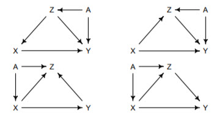

```{r setup, include=FALSE}
knitr::opts_chunk$set(echo = FALSE)
```

## R Markdown

This is an R Markdown presentation. Markdown is a simple formatting syntax for authoring HTML, PDF, and MS Word documents. For more details on using R Markdown see <http://rmarkdown.rstudio.com>.

When you click the **Knit** button a document will be generated that includes both content as well as the output of any embedded R code chunks within the document.

## Slide with Bullets

- Bullet 1
- Bullet 2
- Bullet 3

## Slide with R Output

```{r cars, echo = TRUE}
summary(cars)
```

## Slide with Plot

```{r pressure, fig.width=5, fig.height=4, fig.align='center'}
plot(pressure)
```

## Slide with picture

Some DAGs

```{r picture, fig.width=5, fig.height=4, fig.align='center'}

```
