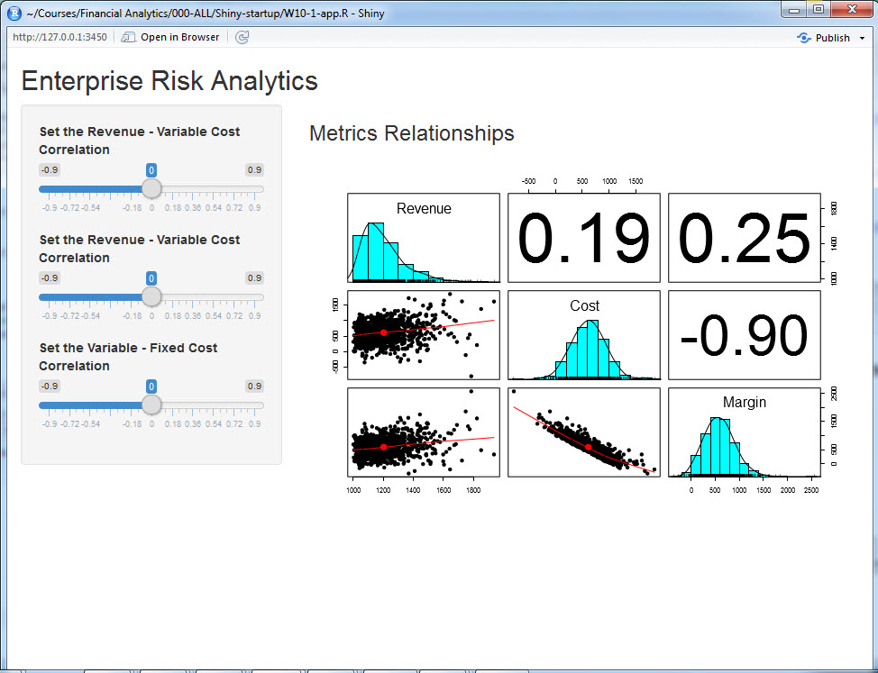

```{r , include=FALSE}
knitr::opts_chunk$set(echo = TRUE, warning=FALSE, message=FALSE)
knitr::opts_chunk$set(tidy = TRUE)
knitr::opts_chunk$set(tidy.opts=list(width.cutoff=36))
```

## The Problem with Enterprise Risk

International Mulch & Compost Company[^IMandC] makes and distributes an emerging energy source made from guano and prairie grass briquets. IM&C is about to go IPO. Corporate policy dictates that management must assess risks to equity annually and whether a circumstance dictates. Such a circumstance is an IPO. 

[^IMandC]: IM\&C is a ficitious company dreamt up and used by [Brealey and Myers in Principles of Corporate Finance.](https://books.google.co.in/books?id=TQGkDwAAQBAJ)

Management knows of at least three material risks:

* Customers defect so there is uncertainty in revenue growth.
* Suppliers stop competing on price, quantity, and quality so there is uncertainty in variable expense.
* There are major compliance breaches which impact fixed expense.

No one knows much about these risks from history because this company is the first in its market to produce this very innovative product from bio-engineered guano. Very abundant prairie grass grows alongside every highway in North America. Management does have considerable experience in marketing, production, and operations. IM&C ponders its SEC disclosure for the IPO where it will report its view of material risks. One question management knows _someone_ will ask is how likely is it that the net operating margin will fall below, say, indicated earnings of $400 million. IM&C thinks it needs to know how much capital is involved in this risk venture.

## Let's make copulas

Our problem is: 

1. We have three major risk factors and each has their own distribution. 
2. We also know that they are somehow correlated. 
3. How can we aggregate the three into one risk measure that is tangible,  and preserve the correlation?

### We do this from scratch. 

Our first task is to generate multivariate normal variates that are correlated with one another. Here we relate three standard normal random variables together.A standard normal random variable has a mean, $\mu = 0$, and variance, $\sigma^2 = 1$. The variable `sigma` in the code below is the _correlation_ matrix.

```{r }
library(mvtnorm)
set.seed(1016)
n.risks <- 3 ## Number of risk factors
m <- n.risks
n.sim <- 1000
sigma <- matrix(c(1, 0.4, 0.2,
                  0.4, 1, -0.8,
                  0.2, -0.8, 1), 
                nrow=3)
z <- rmvnorm(n.sim, mean=rep(0, nrow(sigma)),sigma = sigma, method = "svd") 
```

In the `rmvnorm` function `svd` stands for the "singular value decomposition" that allows us to fan the correlations across the `z` values.

### Example

Let's use the `.panels` feature in the `psych` library to look at the variates so far. We also calculate two kinds of correlations, _Spearman_ and _Pearson_.

```{r }
library(psych)
cor(z,method='spearman') ## Textbook calculation
cor(z,method="pearson") ## Rank order calculation
pairs.panels(z)
```

Notice how close the correlations are to the ones we specified in `sigma`.

## Sklar's in the house...

Next we use a result from mathematical probability called 

**Sklar's theorem (1959)**: 

- If $x$ is a random variable with distribution $F$,
- then $F(x)$ is uniformly distributed in the interval $[0, 1]$. 

Let's translate this idea into `R` and look at the resulting interactions.

```{r }
require(psych)
u <- pnorm(z)
pairs.panels(u)
```

We see that the Gaussian (normal) distribution has been reshaped into a uniform distribution, just as Sklar predicted.

The idea around this theorem is the same as around the number 1. We can multiply any real number by one and get the real number back. This is an identity operation. (Please remember we are not trying to be mathematicians! My apologies to the mathematical community.) In a somewhat analogous way, the uniform distribution serves a role as an distribution identity operator.When we operate on the uniformly distributed random numbers with a distribution, we get back that distribution. But in this case the identity distribution has structure in it (correlations) that the new distribution inherits.

A 3-D plot looks more interesting. In the Rstudio graphics device window we can the roll the cube around to see into the relationships among the random variables. Try this at home for an interactive experience.

```{r, eval = FALSE}
library(rgl)
plot3d(u[,1],u[,2],u[,3],pch=20,col='orange')
```

Now, we only need to select the marginal probabilities of the risks we are assessing and apply them to the dependently related 'u' variates. Suppose the marginal probability distributions for revenue growth is `gamma`, variable expense ratio is `beta`, and the fixed expense ratio is Student's t distributed with these parameters: 

```{r }
x1 <- qgamma(u[,1],shape=2,scale=1)
x2 <- qbeta(u[,2],2,2)
x3 <- qt(u[,3],df=5)
```

Nice outliers! Starting from a multivariate normal distribution we created dependent uniform variates. Using the dependent uniform variates we created dependent distributions of our choosing. 

```{r }
factors.df <- cbind(x1/10,x2,x3/10)
colnames(factors.df) <- c("Revenue", "Variable Cost", "Fixed Cost")
pairs.panels(factors.df)
cor(factors.df,method='spearman')
```

## Analyze that...

Now to use all of this simulation to project revenue, expense, and margin. 

```{r }
revenue <- 1000*(1+factors.df[,1])
variable.cost <- revenue * factors.df[,2]
fixed.cost <- revenue * factors.df[,3]
total.cost  <- variable.cost + fixed.cost
operating.margin  <- revenue - variable.cost - fixed.cost
analysis  <- cbind(revenue,total.cost,operating.margin)
colnames(analysis) <- c("Revenue", "Cost", "Margin")
```

### Example

Run `pairs.panels` using the `analysis` data frame. What do you see?

Here's the result.

```{r }
pairs.panels(analysis)
```

What do we see?

1. Variable and fixed cost aggregate into a distribution that is right-skewed.
2. Margin has a high density across a broad range of potential outcomes.
3. An increase (decrease) in cost will probably result in an increase (decrease) in revenue.
4. Revenue and margin also seem to be counter cyclical, a non-intuitive result, but one that makes sense only by looking at the negative correlation between cost and margin.

## Risk measures

We are not yet done. The whole point of this analysis is to get consistent and coherent measures of risk to a consumer of the analysis, namely, the decision maker who is the CFO in this case.  We define the value at risk, $VaR$, as the $\alpha$ quantile of the performance metric of interest. Higher $\alpha$ means lower risk tolerance. Here is the relationship: 
\[
Q(x,\alpha) = F(x; Prob[X] > \alpha).
\]
The metric $x$ in this case is margin. Expected Shortfall, $ES$, is then the mean of the margin beyond $VaR$. The parameter $\alpha$ is the level of organizational risk tolerance. If $\alpha = 0.99$, then the organization would want risk capital to cover a potential loss of $VaR$, and more conservatively, $ES$. The organization is even more conservative the higher the $\alpha$.

We purloin the R code from the market risk material here:

```{r }
### Simple Value at Risk
expected.margin <- 400
## Center margin loss on expected margin
loss.rf <- -(expected.margin - operating.margin) 
## Assign metric of interest to reusable code
summary(loss.rf) 
## Always review a key variable's content
alpha.tolerance <- .99 
## Very intolerant!
## Remember that putting a variable assignment in parentheses also prints the result
(VaR.hat <- quantile(loss.rf, probs=alpha.tolerance, names=FALSE))
### Just as simple Expected shortfall
(ES.hat <- mean(loss.rf[loss.rf > VaR.hat]))
```

Let's plot the results.

```{r }
hist(loss.rf, xlab = "Operating Margin", ylab = "Frequency", main = "Margin Loss Tolerance")
abline(v = VaR.hat, col = "red")
```

Sklar provides us with a way to join together any set of distributions. It transforms correlated variates into a uniform distribution. The uniform distribution takes on the role of the number 1 in algebra. Anything multiplied by 1 returns itself. In a very loose way, the uniform distribution is the identity distribution, just like one is the identity term in algebra. So that whenever we operate on the uniform distribution we get back the same distribution -- but this time with correlation.

The rub is the starting point. Here we used the Gaussian (normal) distribution. This is not a very thickly tailed distribution, and it can be shown that extreme events are not dependent on one another using this distribution. This is NOT a useful feature ultimately. 
So, analysts use more thickly tailed distributions such as the Student-t and the generalized Pareto distribution (GPD) to get dependency far out into the tails. This is nearly perfect for risk managers and decision makers.

### Example

Let's use this R code to modify the copula-making machine we just built. Instead of `rmvnorm` we will use `rmvt` to generate the correlated risk factors. This is called a **t-copula**.

```{r }
library(mvtnorm)
library(psych)
set.seed(1016) ## Freezes the random seed to reproduce results exactly
n.risks <- 3 ## Number of risk factors
m <- n.risks
n.sim <- 1000
sigma <- matrix(c(1, 0.4, 0.2,
                  0.4, 1, -0.8,
                  0.2, -0.8, 1), 
                nrow = m)
z <- rmvt(n.sim, delta = rep(0, nrow(sigma)),sigma = sigma, df = 6, type = "shifted")
```

Here are the results of our experiment. Let's go through the paces. First we look at the `z` variates we simulated using the multivariate Student's t-distribution. 

```{r }
pairs.panels(z)
```

We then run the uniform distribution generator (with correlation structure).

```{r , echo = FALSE}
u <- pt(z, df = 6)
pairs.panels(u)
```

Now, we only need to select the marginal probabilities of the risks we are assessing and apply them to the dependently related 'u' variates. Again suppose the marginal probability for revenue growth is `gamma`, for the variable expense ratio is `beta`, and fixed expense ratio is Student's t distributed with these parameters: 

```{r }
x1 <- qgamma(u[,1],shape=2,scale=1)
x2 <- qbeta(u[,2],2,2)
x3 <- qt(u[,3],df=6)
```

Starting from a multivariate Student's t-distribution we created dependent uniform variates. Using the dependent uniform variates we created dependent distributions of our choosing. 

Next we combine the series into a data frame and review the scatterplot matrix.

```{r }
factors.df <- cbind(x1/10,x2,x3/10)
colnames(factors.df) <- c("Revenue", "Variable Cost", "Fixed Cost")
pairs.panels(factors.df)
## cor(df,meth='spearman') could also be run to verify the pairs.panels()
```

Again, we have nice outliers! (We could run the `qqplot` to see this). Now to use all of this to project revenue, expense, and margin. 

```{r }
revenue <- 1000*(1+factors.df[,1])
variable.cost <- revenue * factors.df[,2]
fixed.cost <- revenue * factors.df[,3]
total.cost  <- variable.cost + fixed.cost
operating.margin  <- revenue - variable.cost - fixed.cost
analysis.t  <- cbind(revenue,total.cost,operating.margin)
colnames(analysis.t) <- c("Revenue", "Cost", "Margin")
```

And again here is the scatterplot matrix.

```{r }
pairs.panels(analysis.t)
```

We can...

1. Experiment with different degrees of freedom to sensitive ourselves to the random numbers generated.
2. Parameterize correlations. This means assign correlations to a variable and place that variable into the `sigma` matrix. This might get into trouble with an error. It would mean we would have to reassign the correlation. The mathematical problem is finding a **positive definite** variance-covariance matrix.
3. How different are the value at risk and expected shortfall measures between the use of the Gaussian (normal) copula and the t-copula? Why should a decision maker care?

All of that experimentation begs for an interactive decision tool.

## Let's build an app ...

The application (the "app") will be housed in an `R` script that contain four architectural layers.

1. Analytics
2. User Interface (UI)
3. Server
4. Application generator

### Analytics

1. Libraries used in app processes
2. Function that wraps analytical script
3. Inputs from UI layer to server layer
4. Outputs from server layer to UI layer

### UI

1. Slide bars for user to input range of parameters
2. Plots to display results
3. Text to report results

### Server

1. Run analytics with inputs from the UI and from a simulation function
2. Generate outputs for UI

### Application generator

Here we run application function with UI and Server inputs

## The simulation function

The `risk.sim` function is a wrapper that pulls all of the risk aggregation together. In our scenario we vary the correlation coefficients. `Shiny` calls these `input` and this is what is given to `risk.sim` through the `ui` to `risk.sim` by way of the `server`. `risk.sim` then outputs the results into result called `analysis.t`. This is fetched by the `server` and rendered in the app.

```{r tidy = TRUE, tidy.opts=list(width.cutoff=36), eval = FALSE}
library(shiny)
require(mvtnorm)
require(psych)
risk.sim <- function(input) {
  ## Begin enterprise risk simulation
  set.seed(1016) ## Freezes the random seed to reproduce results exactly
  n.risks <- 3 ## Number of risk factors
  m <- n.risks
  n.sim <- 1000 ## pull slider settings into the sigma correlation matrix
  sigma <- matrix(c(1, input[1], input[2], input[1], 1, input[3], input[2], input[3], 1), nrow = m)
  z <- rmvt(n.sim, delta = rep(0, nrow(sigma)),sigma = sigma, df = 6, type = "shifted")
  u <- pt(z, df = 6)
  x1 <- qgamma(u[,1],shape=2,scale=1)
  x2 <- qbeta(u[,2],2,2)
  x3 <- qt(u[,3],df=6)
  factors.df <- cbind(x1/10,x2,x3/10)
  colnames(factors.df) <- c("Revenue", "Variable Cost", "Fixed Cost")
  revenue <- 1000*(1+factors.df[,1])
  variable.cost <- revenue * factors.df[,2]
  fixed.cost <- revenue * factors.df[,3]
  total.cost  <- variable.cost + fixed.cost
  operating.margin  <- revenue - variable.cost - fixed.cost
  analysis.t  <- cbind(revenue,total.cost,operating.margin)
  colnames(analysis.t) <- c("Revenue", "Cost", "Margin")
  return(analysis.t)
  }
```

## The UI

Here is a mock-up of the screen we will implement in Shiny.


Here is what the Shiny UI code looks like:

```{r eval = FALSE}
ui <- fluidPage(
  titlePanel("Enterprise Risk Analytics"),
  sidebarLayout(
    sidebarPanel(
      sliderInput(inputId = "cor.1", 
              label = "Set the Revenue - Variable Cost Correlation", 
              value = 0.5, min = 0.1, max = 0.9),
      sliderInput(inputId = "cor.2", 
              label = "Set the Revenue - Variable Cost Correlation", 
              value = 0.5, min = 0.1, max = 0.9),
      sliderInput(inputId = "cor.3", 
              label = "Set the Variable - Fixed Cost Correlation", 
              value = 0.5, min = 0.1, max = 0.9)
    ),
    mainPanel(
      plotOutput("pairs.1")
    )
  )
)
```

## The server

- The Shiny server is a function
- The function gets inputs from the UI
- Generates outputs that are sent back to the UI

```{r , eval = FALSE}
server <- function(input, output) {
  output$pairs.1 <- renderPlot({
    analysis.t <- risk.sim(c(input$cor.1, input$cor.2, input$cor.3))
    pairs.panels(analysis.t)
  })
}
```

## Run the app
This function call the Shiny application process with inputs `ui` and `server`. 

```{r , eval = FALSE}
shinyApp(ui = ui, server = server)
```
Here is what you see when you run the app in the script window of Rstudio.



## What else could we do?

- Build tabs for various components of the analysis
- Use tables to summarize metrics (e.g., VaR, ES)
- Whatever else the consumer of this analysis would need

## Summary

- More and more `R`, finance, risk, statistics, probability 
- Multivariate simulation of risk factors
- Math to `R` translation
- Graphics
- Normal, t, gamma, and beta distributions
- VaR and ES
- Aggregation of multiple risk factors
- Introduction to `Shiny` and application development

## References
